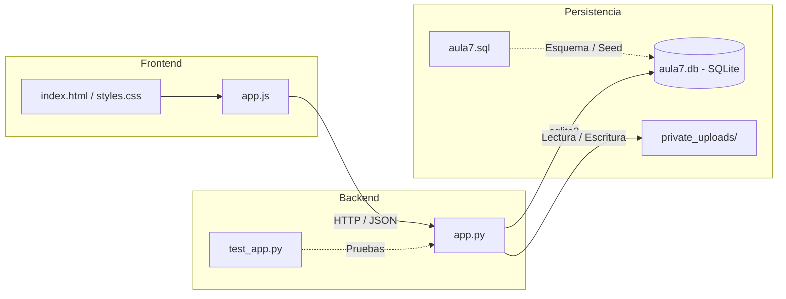

```mermaid
flowchart LR
    subgraph Frontend
        UI[index.html / styles.css]
        JS[app.js]
    end

    subgraph Backend
        API[app.py]
        TESTS[test_app.py]
    end

    subgraph Persistencia
        SQL[aula7.sql]
        DB[(aula7.db - SQLite)]
        FILES[private_uploads/]
    end

    UI --> JS
    JS -->|HTTP / JSON| API
    TESTS -.->|Pruebas| API
    SQL -.->|Esquema / Seed| DB
    API -->|sqlite3| DB
    API -->|Lectura / Escritura| FILES
```
