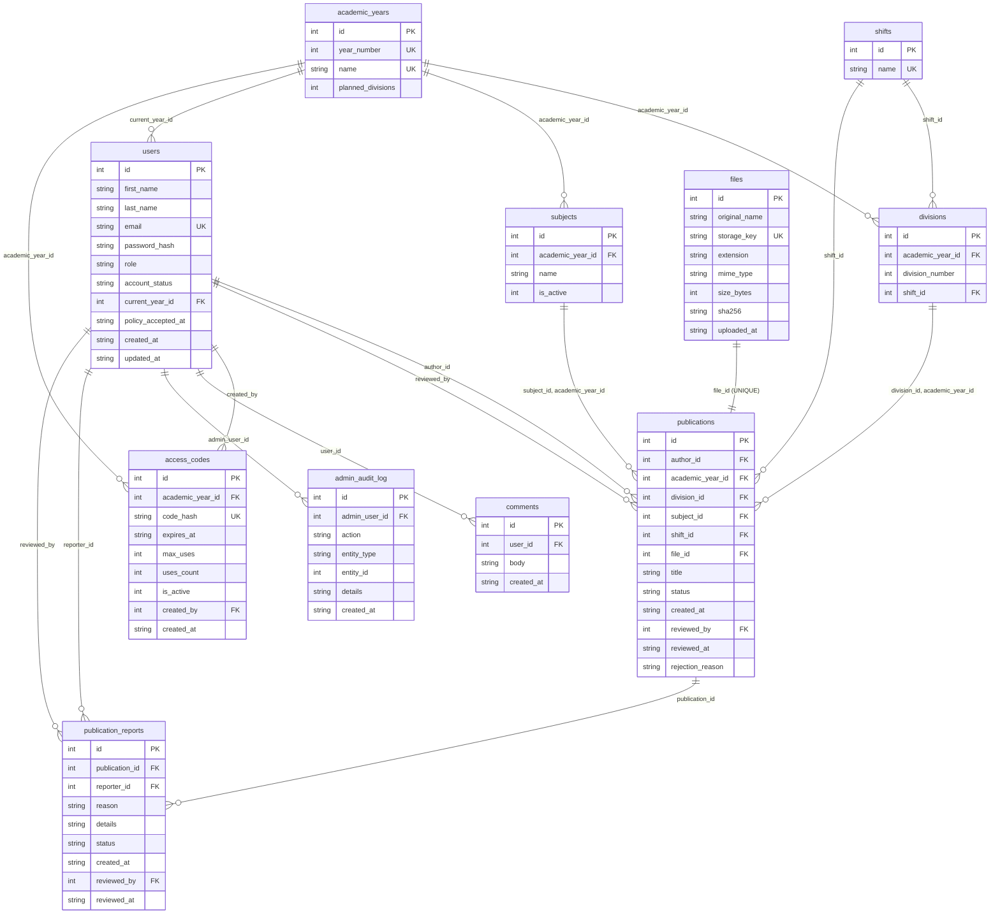

```mermaid

    TESTS -.->|Pruebas| API
    SQL -.->|Esquema / Seed| DB
    API -->|sqlite3| DB
    API -->|Lectura / Escritura| FILES
```

```mermaid
erDiagram
    academic_years {
        int id PK
        int year_number UK
        string name UK
        int planned_divisions
    }

    shifts {
        int id PK
        string name UK
    }

    divisions {
        int id PK
        int academic_year_id FK
        int division_number
        int shift_id FK
    }

    subjects {
        int id PK
        int academic_year_id FK
        string name
        int is_active
    }

    users {
        int id PK
        string first_name
        string last_name
        string email UK
        string password_hash
        string role
        string account_status
        int current_year_id FK
        string policy_accepted_at
        string created_at
        string updated_at
    }

    access_codes {
        int id PK
        int academic_year_id FK
        string code_hash UK
        string expires_at
        int max_uses
        int uses_count
        int is_active
        int created_by FK
        string created_at
    }

    files {
        int id PK
        string original_name
        string storage_key UK
        string extension
        string mime_type
        int size_bytes
        string sha256
        string uploaded_at
    }

    publications {
        int id PK
        int author_id FK
        int academic_year_id FK
        int division_id FK
        int subject_id FK
        int shift_id FK
        int file_id FK
        string title
        string status
        string created_at
        int reviewed_by FK
        string reviewed_at
        string rejection_reason
    }

    publication_reports {
        int id PK
        int publication_id FK
        int reporter_id FK
        string reason
        string details
        string status
        string created_at
        int reviewed_by FK
        string reviewed_at
    }

    comments {
        int id PK
        int user_id FK
        string body
        string created_at
    }

    admin_audit_log {
        int id PK
        int admin_user_id FK
        string action
        string entity_type
        int entity_id
        string details
        string created_at
    }

    academic_years ||--o{ divisions : "academic_year_id"
    academic_years ||--o{ subjects : "academic_year_id"
    academic_years ||--o{ users : "current_year_id"
    academic_years ||--o{ access_codes : "academic_year_id"
    shifts ||--o{ divisions : "shift_id"
    shifts ||--o{ publications : "shift_id"
    divisions ||--o{ publications : "division_id, academic_year_id"
    subjects ||--o{ publications : "subject_id, academic_year_id"
    files ||--|| publications : "file_id (UNIQUE)"
    users ||--o{ publications : "author_id"
    users ||--o{ publications : "reviewed_by"
    users ||--o{ access_codes : "created_by"
    users ||--o{ comments : "user_id"
    users ||--o{ admin_audit_log : "admin_user_id"
    users ||--o{ publication_reports : "reporter_id"
    users ||--o{ publication_reports : "reviewed_by"
    publications ||--o{ publication_reports : "publication_id"
```
